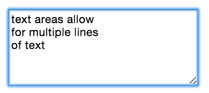

# Form Elements

### You should already know about
* [HTML Documents](../html-documents/README.md)

Now that you're a pro at putting together HTML documents, let's look at a couple new HTML elements that will be super useful if you want to gather information from users of your websites. We'll talk about the basic and most important form elements.

`<input type="text">`
---

This is your most basic form element. It's simply a single line text box that a user can type something into. Many of the form elements all use the same input tag, and are differentiated by the `type` attribute. This element is self-closing, meaning it does not need a closing tag.


`<input type="radio">`
---

Radio buttons are used when a user needs to choose one, and only one option. This element is self-closing, meaning it does not need a closing tag.


`<input type="checkbox">`
---

Checkboxes are used when a user can pick one or more options. This element is self-closing, meaning it does not need a closing tag.


`<select>` and `<option>`
---

The select element is similar to the radio button in that it allows a user to select one option from a list. Selects are often used over radio buttons when the list of available options is long, because they don't take up as much space. Select elements are used in conjunction with option elements like so:

```html
<select>
	<option value="1">Option 1</option>
	<option value="2">Option 2</option>
	<option value="3">Option 3</option>
	<option value="4">Option 4</option>
</select>
```


`<textarea>`
---

The text area is essentially the same as `<input type="text">` except that it can contain multiple lines of input. `<textarea>` is also *not* self closing, so you must include a closing tag. Anything in between the opening and closing tags will be put inside the text area element as starting text.



`<button>`
---

Button elements are also fairly self-explanatory. They are a button that the user can click on. Button elements must have a closing tag and anything inside of the opening and closing tags will show up inside of the button.


`<label>`
---

Labels allow us to add some useful functionality to our form elements. They are especially useful in conjunction with radio buttons and check boxes. Any form element that you put inside of a `<label>` element will get clicked when you click on the label. For example, you could have a series of radio buttons with text next to them. You could wrap the text and the radio buttons inside of a `<label>` so that when you click on the text, it toggles the radio button. This is nice because radio buttons are small, so it's nice to be able to click on either the radio button or the text next to it in order to select it. For example:

```html
<label>
	<input type="radio"> Option 1
</label>
<label>
	<input type="radio"> Option 2
</label>
<label>
	<input type="radio"> Option 3
</label>
```

### The value attribute

Each form element can have an optional value attribute. Whatever you set as the value attribute is how javascript will see the input when we access it programmatically. For example:

```html
<select>
	<option value="1">Option 1</option>
	<option value="2">Option 2</option>
	<option value="3">Option 3</option>
	<option value="4">Option 4</option>
</select>
```

If you use JavaScript to ask which option is selected, it will respond with the value of that option.

You can also use the value attribute to pre-fill certain form elements like text boxes. For example:

```html
<input type="text" value="This is a test">
```

When you load the page, the input element will be pre-filled with the text "This is a test." The value attribute does not work for `<textarea>` elements. Instead, you put the pre-filled content right in between the opening and closing tags of the textarea.

### The placeholder attribute

In addition to the value attribute, text boxes and text areas can have a placeholder attribute. This attribute is often used to guide the user as to which type of information they should enter. For example:

```html
<textarea placeholder="Write a story"></textarea>
```

Placeholder text usually appears as a lighter gray color and disappears as soon as a user starts to type in their own input.


## More Resources

There are a whole bunch of other HTML form elements designed for different purposes. We only touched on the most basic elements.

* [Full list of form elements](https://developer.mozilla.org/en-US/docs/Web/Guide/HTML/Forms)
* [Different type of input elements](https://developer.mozilla.org/en-US/docs/Web/HTML/Element/input)