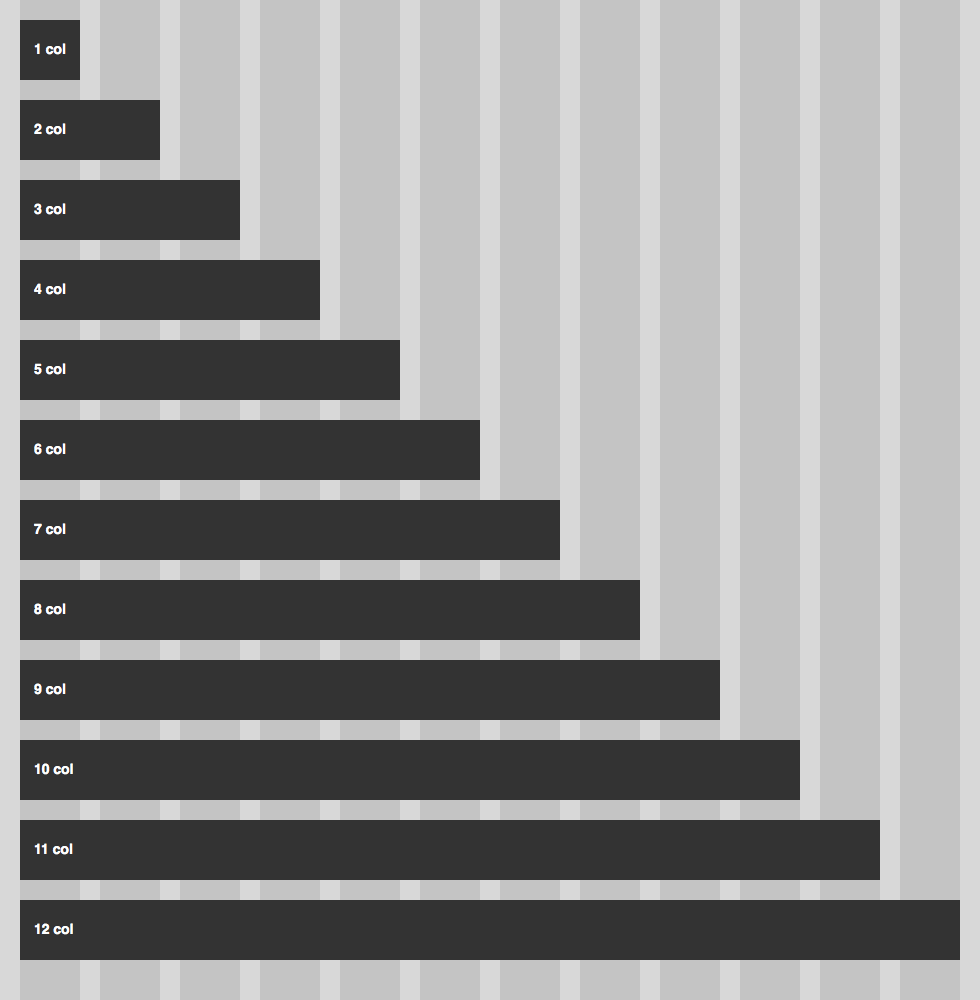

# HTML Documents

### You should already know about
* [Sass](../sass/README.md)
* [CSS Box Model](../css-box-model/README.md)
* [CSS Layout](../css-box-model/README.md)
* [CSS Centering](../css-centering/README.md)

If you build enough websites you start to see patterns that repeat over and over again. When we lay out our pages they often follow a consistent pattern of columns and rows. Grid systems in CSS are a commonly used to lay out our content in a consistent and standardized way. They organize our HTML and make developing responsive websites easier and faster.

Grid systems are simply a methodology for how to lay out content on your pages. There are a number of different CSS frameworks and libraries out there that use the grid system methodology. Some of the popular ones are [Bootstrap](http://getbootstrap.com), [Zurb Foundation](http://foundation.zurb.com/) and [Bourbon Neat](http://neat.bourbon.io/). Most of these frameworks and libraries use a CSS pre-processor such as Sass.

Grid systems are generally split up into three parts: gutters, columns and rows. Gutters represent the space in-between content and columns are where the content lives. Grid systems will have a pre-determined, or configurable number of gutters and columns (often 12 columns and 13 gutters).


Content is placed on top of the grid by specifying the number of columns that the content should take up. For example:



You can also specify an offset in order to move content off of the left side of the page:


Each grid framework has a different way of specifying the number of columns and offset. Bootstrap and Zurb Foundation use classes. Bourbon Neat uses Sass mixins. In Bootstrap, the above layout might look like:

```html
<div class="container">
	<div class="row">
		<div class="col-sm-1 col-sm-offset-11"></div>
	</div>
	<div class="row">
		<div class="col-sm-2 col-sm-offset-10"></div>
	</div>
	<div class="row">
		<div class="col-sm-3 col-sm-offset-2"></div>
	</div>
	<div class="row">
		<div class="col-sm-4 col-sm-offset-8"></div>
	</div>
	<div class="row">
		<div class="col-sm-5 col-sm-offset-4"></div>
	</div>
	<div class="row">
		<div class="col-sm-6 col-sm-offset-6"></div>
	</div>
	<div class="row">
		<div class="col-sm-7 col-sm-offset-5"></div>
	</div>
	<div class="row">
		<div class="col-sm-8 col-sm-offset-4"></div>
	</div>
	<div class="row">
		<div class="col-sm-9 col-sm-offset-1"></div>
	</div>
	<div class="row">
		<div class="col-sm-10 col-sm-offset-2"></div>
	</div>
	<div class="row">
		<div class="col-sm-11 col-sm-offset-1"></div>
	</div>
	<div class="row">
		<div class="col-sm-12"></div>
	</div>
</div>
```

## More Resources

* [Bootstrap Documentation](http://getbootstrap.com/css/#grid)
* [Zurb Foundation Documentation](http://foundation.zurb.com/docs/components/grid.html)
* [Bourbon Neat Documentation](http://neat.bourbon.io/examples/)