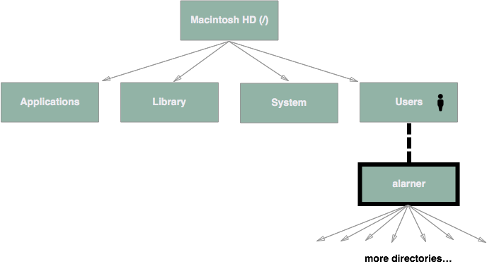
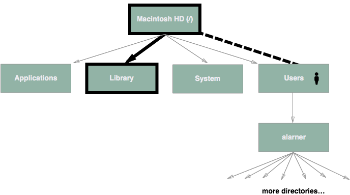

# Paths

### You should already know about
* [Trees](../trees/README.md)

As we learned when we were talking about trees, paths are a sequence of nodes and edges connecting a node with a descendant. Usually when we talk about paths we are talking about files or resources on our computer, or on a server. If you think about it, the file system on your computer can be represented as a tree data structure. For example, on my computer I have a root folder that contains a Users folder. The Users folder contains an alarner folder and the alarner folder contains a bunch of other folders.

If we were to visualize these folders (also sometimes called directories) as a tree, it might look something like this...

The **path** to the alarner directory would look like this...

## Root Relative Paths
When we describe paths in web development we commonly write them like `/Users/alarner`. Notice that as we traverse the path from top to bottom, each time we encounter a node we write the name of the node (the directory name) and each time we encounter an edge we write a `/`. The root node is special because of the way that your Mac names it. If you look at it in the Finder you will see that it's called Macintosh HD, but that's just a nick name. Its real name is `/`. That means if our path starts with a `/` then we are telling the computer to begin in the root directory. Paths that begin with a `/` are called **root relative** paths because they are relative to the root node of the directory tree.

## Document Relative Paths
But we don't always have to describe paths from the root node. This can get a little bit tedious if we are trying to target a deep ancestor of the tree. In order to save us the headache of typing out the full path from the root directory each time, there is another type of path we can use called a **document relative** path.

Document relative paths are specified relative to the document (or node) where we are currently standing. If we are currently inside the `Users` directory, but we want to go to the `alarner` directory, it doesn't make sense to start at the root, because we are already half way there. Starting at the root would be taking one step backwards. Instead, if we don't start our path with a `/` then the computer knows to look for the next node starting from where we are currently standing. so if I was inside of the `Users` directory and wanted to go to the `alarner` directory I could simply say `alarner`. Since I'm already inside of the `Users` directory, the computer is smart enough to know that I'm trying to go to `/Users/alarner`.

With relative paths we can also move "up" to the parent node by using `..` notation. For example, if we are currently inside of the `Users` directory, we could move to the root (Macintosh HD) directory by following the path `..`. Furthermore, we could jump right to the `System` directory by following the path `../System`.

