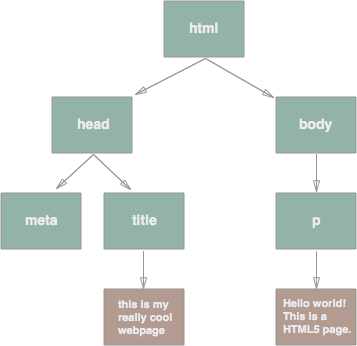

# Scaffolding Webpages with HTML

### You should already know about
* [Trees](../trees/README.md)

## Bare bones HTML5 page
```html
<!DOCTYPE html>
<html>
    <head>
        <meta charset="utf-8">
        <title>this is my really cool webpage</title>
    </head>
    <body>
        <p>Hello world! This is a HTML5 page.</p>
    </body>
</html>
```

## Anatomy of an HTML element

HTML documents consist of a hierarchical tree of HTML elements. Essentially each HTML element is a node in our HTML tree, but what exactly is a HTML element?

A HTML element is comprised of three parts, an **opening tag**, a **closing tag**, and optionally, one or more children / ancestors. In the example above, `<title>this is my really cool webpage</title>` is an HTML element.

`<title>` is the openeing tag. `</title>` is the closing tag. `this is my really cool webpage` is the only child.

Notice that every opening tag follows the format `<` then a name and then `>`. Every closing tag follows the format `</` then the same name as the corresponding opening tag and then `>`.

There are a whole slew of different HTML elements. You can find a comprehensive list [here](https://developer.mozilla.org/en-US/docs/Web/HTML/Element). If you take a quick glace at the list, you'll notice that not a single HTML element has any space or punctuation mark in its name. The name of HTML elements only ever contain alphabetic characters and are case insensitive. We usually write them in all lower case.

Some HTML elements are implicitly closed. This means that they don't require a closing tag, because they never have any children, so they are closed by default. For example, notice that the `<meta charset="utf-8">` opening tag, has no closing tag. That's because the meta tag is implicitly closed.

The `meta` tag is also particularly interesting because it has an attribute in addition to its tag name. Attributes allow you to supply additional information about a particular tag and are comprised of an **attribute name** and an **attribute value**. The attribute name is always followed by an `=` and the attribute value is always enclosed in quotation marks.


## Visualizing the HTML tree

As I mentioned above, every HTML document can be visualized as a tree data structure, with each HTML element representing a node in the tree. Here's what the bare bones HTML5 page from above would look like if it were visualized as a tree.



The `<html>` element is always the root node within our HTML tree. Each other HTML element on the page also represents a node, as does the text inside of HTML elements.

## Line by line description

The first line is called the **doctype** declaration. It tells the browser which version of HTML to use. We will be writing all of our HTML using HTML5. Almost all HTML tags require both an opening tag <...> and a closing tag </...>. The doctype declaration is one of the few that does not require a closing tag.

	<!DOCTYPE html>

In the second line we are opening the HTML document. Every HTML document is opened with the `<html>` tag and closed with the `</html>` tag. The opening and closing HTML tags are like the pieces of bread at the top and bottom of a sandwich (a formality - all the good stuff is inside!).

	<html>

The third line opens the head tag. Notice that it is indented (with a tab) to denote that the head tag resides *inside* (or as a child of) the html element. The head tag contains a bunch of information about the HTML page, including the page title that appears at the top of the browser window, the icon that appears next to the title, etc.

		<head>

The fourth line specifies the character set that should be used by the browser. Character sets are a really complicated subject, but it's important to have a basic understanding of them. Basically since computers interperate everything as numbers, each letter, number, symbol, etc. is represented by a number. Just like there are different versions of HTML, there are also different ways to interperate which number corrolates to which symbol on the keyboard. **We almost always want to use `utf-8` for our character set.** [This is an excellent article](http://www.joelonsoftware.com/articles/Unicode.html) that describes the nitty gritty details of how character sets work. If you're interested you should read it. At bare minimum use it as a resource if you ever run into character set issues. They can be nasty to fix.

			<meta charset="utf-8">

The fifth line opens and closes the title element. The title element specifies what the title of the page should say in the browser tab. In addition to being helpful for visitors with multiple tabs open, the words in your title tag are also used by search engines to rank your website for those keywords. As a rule of thumb, no two pages should have the same title.


			<title>this is my really cool webpage</title>

The sixth line closes out the head section of our HTML document. Remember that almost every type of HTML element requires both an opening tag and a closing tag.

		</head>

Next we open up the body element. Each HTML document has only one head and one body element. The body element is where everything that you see on the page lives.

		<body>

An empty page would be pretty boring, so we'll add a paragraph of text, denoted by the paragraph (p) element. In most cases, any text you write inside of an element will show up on the page. There are a whole slew of other types of elements. [Mozilla](https://developer.mozilla.org/en-US/docs/Web/HTML/Element) is a great resource for learning the purposes of all of the elements that go inside of the body element.

			<p>Hello world! This is a HTML5 page.</p>

Finally we need to close out all of the tags that we've opened.

		</body>
	</html>