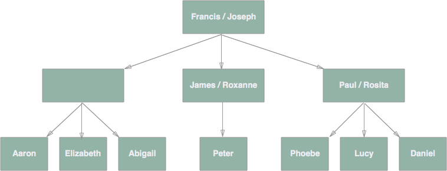
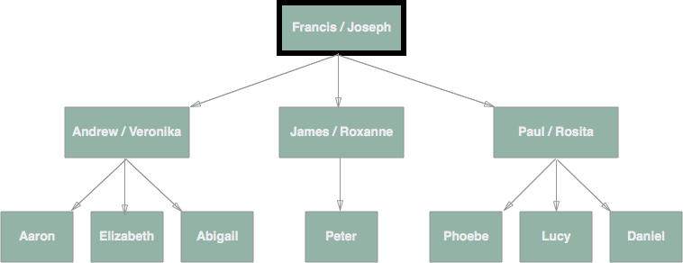
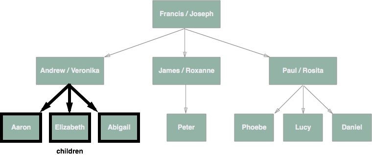
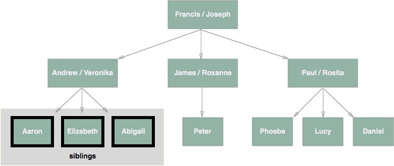
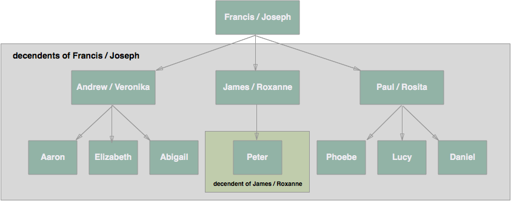
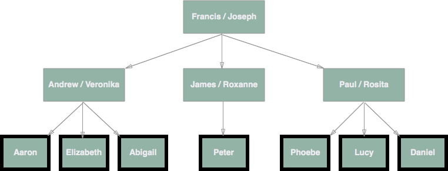

# Trees

You are going to encounter trees every single day in your web development career. They represent a very powerful pattern when trying to organize information. Trees describe a special way that we as programmers use to organize information. They are especially useful for organizing hierarchical information and are called trees because when you visualize the information it looks kind of like an upside down tree.

You are probably already familiar with tree data structures. For example, your family can be described as a tree (a family tree). In fact, we often describe the relationship between data in a tree like we would a family. Here's my fathers side of my family tree:

In computer science terminology, we call each person, or pair of people, in the tree a "node." My uncle Paul and Aunt Rosita represent a single node, as does my cousin Lucy and my sisters Elizabeth and Abigail. "node" is a generic way of describing one piece of data within a tree.

A tree is essentially a collection of nodes ordered in a hierarchical way.

Here is a list of terms we use when talking about trees.

## node
A single point of data within a tree.

## root
The top most node of the tree. In the case of my family tree it would be the `Joseph / Francis` node.

## parent
The node directly above the node in question. For example, `Andrew / Veronica` is the parent node of me (`Aaron`). A node can only have one parent.

## child
Any nodes directly below the node in question. For example, `Aaron`, `Elizabeth` and `Abigail` are all children of the `Andrew / Veronica` node.

## siblings
Nodes with the same parent.

## descendent (or ancestor)
A node anywhere below the node in question. For example, every other node is a descendent of the `Joseph / Francis` node. Only `Peter` is a descendent of the `James / Roxanne` node. In other words: a node reachable by repeated proceeding from parent to child.

## leaf
A node with no children (`Daniel`, `Phoebe`, `Lucy`, `Peter`, `Aaron`, `Elizabeth`, `Abigail`)

## edge
Connection between one node to another.

## path
A sequence of nodes and edges connecting a node with a descendant.

As I alluded to above, tree data structures are used everywhere in web development. HTML itself is a tree, javascript heavily uses trees, and files / folders on your computer are structured as a tree.
