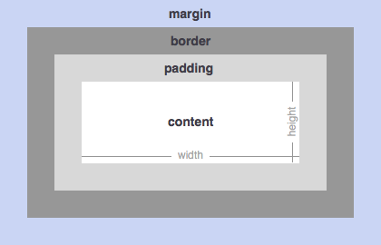
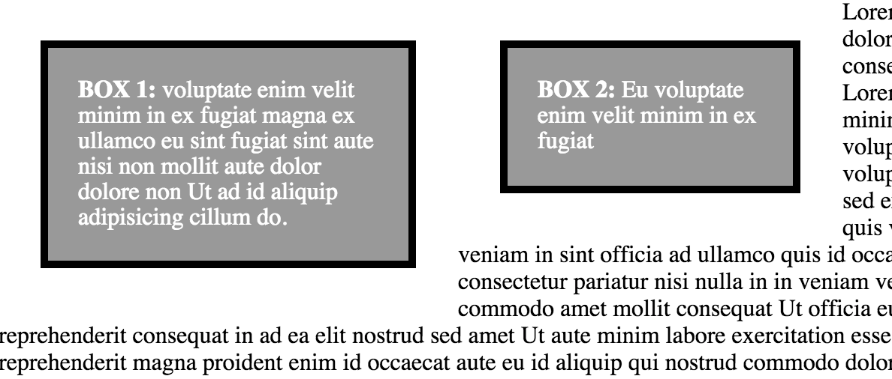

# CSS Box Model

### You should already know about
* [CSS Introduction](../css-introduction/README.md)
<!-- * [CSS Layout](../css-layout/README.md) -->

Everything in HTML and CSS can be described as a rectangular box. All we do when we are applying CSS properties is specifying what that box should look like. There are a few crtitcal properties that we use to size and orient our boxes (HTML elements). Those properties are:

1. width
2. height
3. padding
4. border
5. margin
6. box-sizing

Combined, these six properties describe the **CSS box model**. The **width** and **height** are fairly self explanatory. They specify the width and height of the *contents* of the box. The contents is the area that can contain child elements or text. By default they do not include the padding, border, or margin - those properties extend the size of the overall box.



The *padding* specifies how much space there is between the contents of the box and the border. If you apply a background style to your box, that background will be applied to both the contents and the padding of the box.

##### padding example
```css
.box {
	padding: 20px;
}
```

The *border* specifies the size and style of any border that should be applied to the box.

##### padding example
```css
.box {
	border: 1px solid black;
}
```

The *margin* specifies how much space their should be between this box and other elements on the page. It's essentially a buffer zone.

##### margin example
```css
.box {
	margin: 16px;
}
```

*box-sizing* specifies how the width and height properties should be applied. There are two important options, *content-box* and *border-box*. `box-sizing: content-box` is the default value for all block elements and does *not* include the padding or border widths when applying the `width` and `height` properties. `box-sizing: border-box` is the alternate option, and it *does* include the padding and border widths when applying the `width` and `height` properties. Here is an example of how box-sizing effects two different boxes.

```css
.box {
	background: #999;
	float: left;
	color: #fff;
	line-height: 17px;

	width: 200px;
	height: 102px;
	padding: 20px;
	border: 5px solid #000;
	margin: 28px;
}

.box1 {
	box-sizing: content-box;
}

.box2 {
	box-sizing: border-box;
}
```

##### box-sizing visualized


Notice how both the width and height of the second box is smaller because `box-sizing: border-box` includes the padding and border widths in the with and height measurements, instead of adding them on top of the width and height.

## A note on padding, border and margin
The padding, border and margin properties all have multiple forms. Each can set the properties for all sides of the box, or selectively each side individually.

##### examples of how to set padding multiple different ways
```css
// Sets the padding on all sides of the box to 20px
.box1 {
	padding: 20px;
}

// Sets the padding on the top and bottom to 20px and the left and right to 10px
.box2 {
	padding: 20px 10px;
}

// Sets the padding on each side:
// * top = 10px
// * right = 20px
// * bottom = 30px
// * left = 35px
.box3 {
	padding: 10px 20px 30px 35px;
}

// Sets the padding on all sides to 10px except the top, which is 20px
// padding-bottom, padding-left, and padding-right are also valid properties.
.box4 {
	padding: 10px;
	padding-top: 20px;
}
```

##### examples of how to set margin multiple different ways
```css
// Sets the margin on all sides of the box to 20px
.box1 {
	margin: 20px;
}

// Sets the margin on the top and bottom to 20px and the left and right to 10px
.box2 {
	margin: 20px 10px;
}

// Sets the margin on each side:
// * top = 10px
// * right = 20px
// * bottom = 30px
// * left = 35px
.box3 {
	margin: 10px 20px 30px 35px;
}

// Sets the margin on all sides to 10px except the top, which is 20px
// margin-bottom, margin-left, and margin-right are also valid properties
.box4 {
	margin: 10px;
	margin-top: 20px;
}
```

##### examples of how to set border multiple different ways
```css
// Sets the border on all sides of the box to 20px
.box1 {
	border: 1px solid black;
}

// Sets a different border on each side
.box2 {
	border-top-width: 10px;
	border-top-style: solid;
	border-top-color: red;
	border-right-width: 3px;
	border-right-style: dashed;
	border-right-color: blue;
	border-bottom-width: 4px;
	border-bottom-style: solid;
	border-bottom-color: green;
	border-left-width: 10px;
	border-left-style: solid;
	border-left-color: black;
}
```

## More Resources

* [CSS Box Model - csstricks](https://css-tricks.com/the-css-box-model/)
* [CSS Box Model - MDN](https://developer.mozilla.org/en-US/docs/Web/CSS/box_model)
* [Look up documentation for all of these properties on codrops](http://tympanus.net/codrops/css_reference/)
