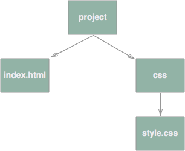

# CSS Introduction

### You should already know about
* [Paths](../paths/README.md)
* [HTML Documents](../html-documents/README.md)

We use CSS to style the look and feel of our HTML pages. If your HTML elements were the foundation and scaffolding of a house, CSS would be the walls and paint and everything else that makes it look like a real building. Both HTML and CSS are essential pieces of web development. We use them together to create our web pages, but it's generally poor practice to mix CSS in your HTML files and vice versa, so we often will create new files to hold our CSS.

Just like we name our HTML files with a `.html` extension, we also add a `.css` extension for our CSS files. I'm going to create a file called `style.css`.

## Linking CSS Files

Once our CSS file is created, we have one more task before we can start styling our HTML elements, we need to link our HTML file with our CSS file, and we do that with the `<link>` tag.

```html
<!DOCTYPE html>
<html>
    <head>
        <meta charset="utf-8">
        <title>this is my really cool webpage</title>
        <link rel="stylesheet" href="css/style.css">
    </head>
    <body>
        <p>Hello world! This is a HTML5 page.</p>
    </body>
</html>
```

On line 6 of this bare bones HTML page I've included a `<link>` tag with two attributes. Link tags always have a `rel` attribute name with a value of `stylesheet`. This tells the browser that we are linking in a CSS file. Finally, the tag also has an `href` attribute. This specifies *where* the CSS file that we are trying to link in is located. Notice that I'm using a document relative path (`css/style.css`) as the value of the `href` attribute. We can tell it's a document relative path because it doesn't begin with a `/`. This particular document relative path is pointing to a file called `style.css` that's located within a css directory. That css directory has the same parent directory as the HTML document that it's being linked from.

If we were to model this whole scenario as a tree, it might look like this:



Notice that we are describing the path to our CSS file relative to the project directory. This is because the file that we are linking from (index.html) is in the project directory, so any relative links in that index.html file are also relative to the project directory.

> ### A note on CSS reset
> There are many different browers out there, and each one has a different default set of CSS properties that it applies to different HTML elements. This can make things really frustrating when trying to get a consistent style across browers. To fix this problem we can use [CSS normalization](http://necolas.github.io/normalize.css/) to set our own default styles for each element, so that each browser starts from the same base point. I **HIGHLY RECOMMEND** using this normalize.css to avoid browser inconsistency issues.
>
> To use normalize.css visit this page and copy the entire contents. Create a new CSS file called normalize.css and paste the contents into the new file. Finally, link the newly created file in your index.html, the same way that we linked the style.css file above. **It's important that you link this file above the style.css file because otherwise it may overwrite the css that you are writing.**

## Structure of CSS Files

After creating a style.css file and using the `<link>` element to link the stylesheet in your HTML we can start writing some CSS. All CSS is written in the form:
```css
selector {
	property-one: value-one;
	property-two: value-two;
	property-three: value-three;
}
```

The selector in each CSS block tells the browser which element or elements the properties inside should be applied to. There are many different ways to specify what elements you want to style. We'll start with classes, which are the simplest. Class selections all start with a dot (.) followed by the name of the class. Class names must start with a letter, but can be followed by numbers, dashes and underscores. For example:

```css
.my-awesome-class {
	
}
```

We can give HTML elements a class by using the `class` attribute like so:

`<p class="my-awesome-class">This is some text</p>`

HTML elements can also have multiple classes. For example:

`<p class="my-awesome-class class2">This is some text</p>`

**Any element that has a specific class will get all of the properties of that class**. There are a whole slew of different CSS properties, [which you can look up here](https://developer.mozilla.org/en-US/docs/Web/CSS/Reference).

Let's start with a blank HTML page with one main element and a little bit of text.
```html
<html>
	<head>
		<meta charset="utf-8">
		<title>HTML Page with CSS</title>
		<link rel="stylesheet" href="css/style.css">
	</head>
	<body>
		<main class="centered">
			This is some text inside the main element.
		</main>
	</body>
</html>
```

Notice that the `main` element has a class on it called `centered`. We will use that class within our style.css file.

```css
.centered {
	background-color: blue;
}
```

The CSS above tells the browser that any element with a class of `centered` should have a `background-color` of `blue`. The selector is `.centered` (meaning: select all elements with a class of centered). The property is `background-color`. The value of the property is `blue`.

Let's add a few more properties:

```css
.centered {
	background-color: blue;
	width: 960px;
	height: 500px;
	margin: 0 auto;
}
```

The width and height properties specify how big the element should be. `margin: 0 auto;` centers the element on the screen.