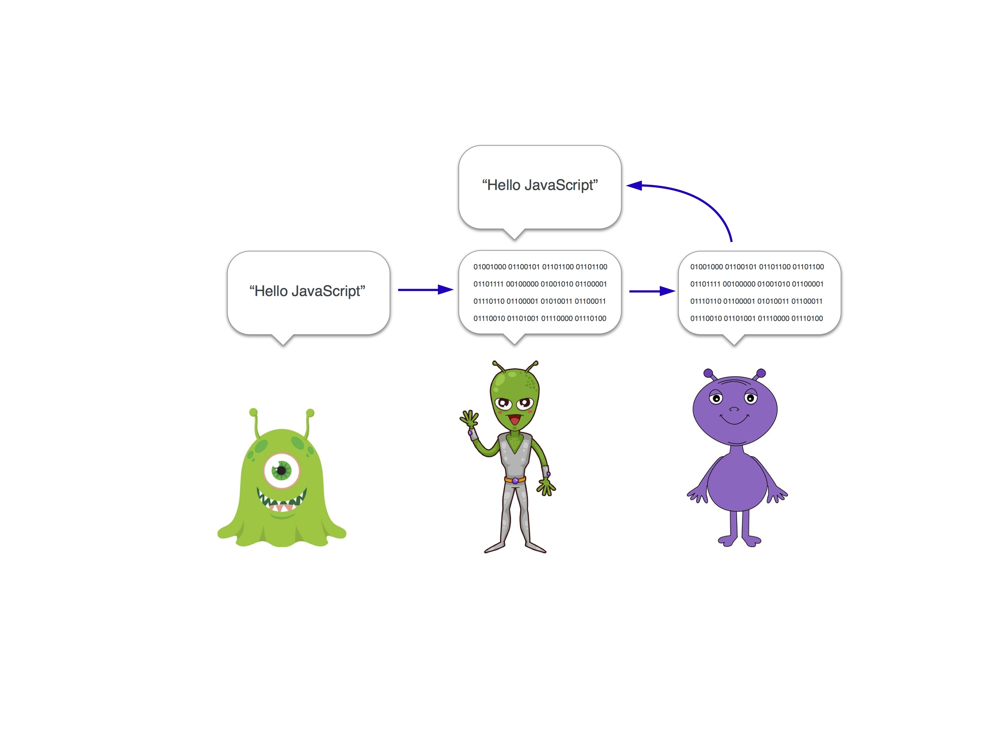
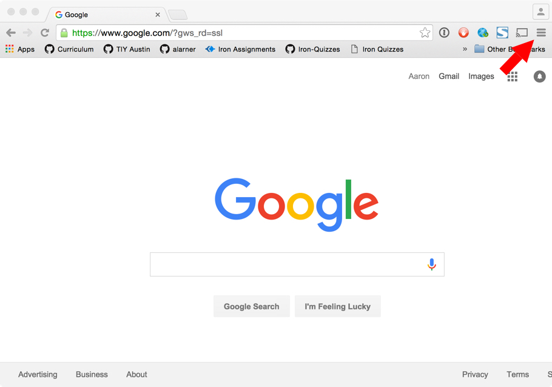
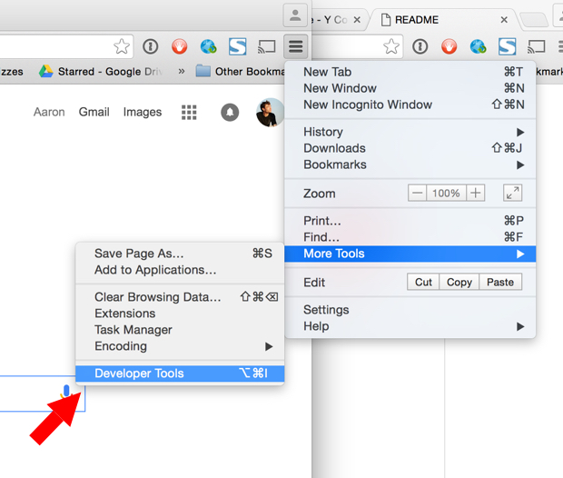
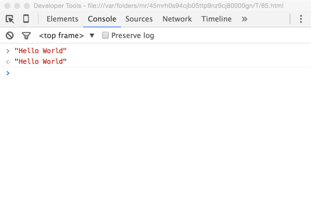
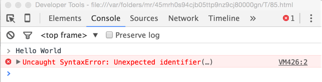
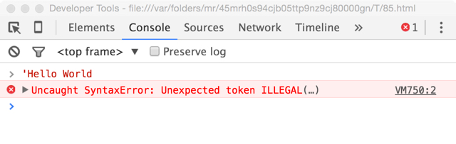

# JavaScript Introduction

## What is "programming?"

I like this description from Kyle Simpson's [You Don't Know JS](https://github.com/getify/You-Dont-Know-JS/blob/master/up%20&%20going/ch1.md)

> A program, often referred to as source code or just code, is a set of special instructions to tell the computer what tasks to perform. Usually code is saved in a text file...

> The rules for valid format and combinations of instructions is called a computer language, sometimes referred to as its syntax, much the same as English tells you how to spell words and how to create valid sentences using words and punctuation.

JavaScript is a programming language, as are Ruby, PHP, Python, C, Java, etc. Each language has different syntax, but they are all simply a set of instructions for the computer to follow.

## Introduction to JavaScript Programming

I was recently in Puebla, Mexico visiting a friend. We were out at one of the most well known Taquería's and I was starving after the long plane flight there. As I was ordering I ran into a problem. I couldn't speak Spanish if my life depended on it and the server didn't speak English. Luckily my friend is fluent in both Spanish and English, so she acted as the interpreter between myself and the server.

Why do I bring this up? Because every day when we write JavaScript code we are interacting with an interpreter. You see, the computer doesn't understand JavaScript and we don't understand the 1's and 0's that the computer does. Lucky for us, there is an interpreter that will translate the JavaScript that we write into a language that the computer can understand. and vice versa. It might look something like this...



We write some JavaScript code, in this case `'Hello World'` and send it off to the interpreter. The interpreter understands JavaScript and translates it to the 1's and 0's that the computer understands and sends it off. The computer, can now reply back to the interpreter, who then translates the reply and sends it back to us. This all happens in the blink of an eye.

In this particular case the computer just responds with the same thing that we sent it. That's just it's way of telling us that it heard us loud and clear. If we make a mistake in the code that we write, either the interpreter or the computer won't understand it and we'll get an error.

## Where is the interpreter?

You might wonder how you go about actually talking to the interpreter. This is actually pretty simple, espcially if you have [Google Chrome](https://www.google.com/chrome) web browser.

##### Simply open up chrome and from any page click on the hamburger menu (three horizontal lines) in the upper right corner...



##### Next mouse over `More Tools >` and then click on `Developer Tools`.



##### This will open up the **console** where you can interact with the interpreter. Try typing in `"Hello World"` (with quotes) and press enter. The interpreter should then display how the computer responded. It should just echo back the same text that you typed in.



## What the string?

In the example above, we didn't actually send an instruction to the computer, we simply sent it some information. "Information" in programming jargon is often called **data** and there are multiple types of data, also known as **data types** or just **types**. Each piece of data always has a type associated with it. `'Hello World'` is an example of a **string** type. Strings are simply text. A person's name, a blog post, or a novel would all be represented as string data in JavaScript.

##### A note on syntax

The interpreter understands that something is a string if it is enclosed in quotation marks (you can use either single or double quotation marks). There are many different rules that the interpreter follows to understand the code that we write. In programming jargon, these rules are called **syntax**. The interpreter distinguishes different data types by different rules. All strings must start with a quotation mark (to let the enterpreter know where the string begins) and end with a quotation mark (to let the interpreter know where the string ends). If an opening quotation mark doesn't have a corresponding closing quotation mark the interpreter will get very confused.

These are all valid strings:

```js
'Hello World'
'John Snow'
'She sells sea shells by the sea shore.'
'ABC'
'123'
"123"
''
'  !  '
```

These are *not* valid strings:

```js
Hello World
```
```js
'Hello World
```
```js
'I like Nutella. It's the best'
```

Let's look at the problems of each of these one by one.

```js
Hello World
```
In this case we forgot to put quotation marks around our string. The interpreter will treat `Hello World` (*without* quotation marks) differently than `'Hello World'` (*with* quotation marks). We'll learn more about what `Hello World` (*without* quotation marks) means a little bit later. If you were to type this in you will confuse the interpreter and it will throw back an error that might look like this...



```js
'Hello World
```
Here we forgot to *close* our quotation mark. Notice that there is a quotation mark at the beginning of the string but not at the end. Again, this will confuse the interpreter (they are easily confused) and it will throw back an error...



These errors might look cryptic, but as you get the hang of programming you will find them extremely helpfulfor diagnosing problems in your code.

```js
'I like Nutella. It's the best'
```

Notice how the interpreter got confused when it encountered the `'` in *It's*. That is because it thinks the string ends there. That is the second quotation mark that it encountered after all. To avoid this we can **escape** a quotation mark with a backslash `\`, also known as the **escape character** to denote that it shouldn't be considered the end of the string like so...

```js
'I like Nutella. It\'s the best'
```
The escape character `\` causes the interpreter to skip over the next character and not consider it when determining where the string should end.

## What did we learn?
**Programming languages** are just a set of rules that allow us to more easily communicate with a machine. The **interpreter** translates the code that we write into instructions that the computer can understand, and replys back to us with something that we can understand as humans.

The **console** is one way that we can interact with the **JavaScript** interpreter (and by hence, the machine).

We can send information, also known as **data**, back and forth to the machine through the interpreter. There are several **data types**, one of which is called a **string**. Strings are simply text that begin with a quotation mark and end with a quotation mark. If we send an instruction that the interpreter or machine do not understand they will throw back an **error**.

## Vocabulary in context
> I'm learning JavaScript so that I can instruct computers to do my bidding!
>
> The interpreter didn't understand the command I gave it so it threw back an error.
>
> The syntax of JavaScript is different than that of some other programming languages.
>
> I used a string data type to store the user's name.

<!--
## JavaScript is a calculator

I like to think about JavaScript as a really fancy calculator that your browser uses to manipulate information. At the end of the day, everything we do with JavaScript is manipulation of information, so it makes sense to start out with the different types of information we might want to manipulate.

JavaScript has a notion of **types**, which are different categories of information that we can manipulate. In our introduction we are going to talk about *three* of the most important types in JavaScript. Those types are: numbers, strings and booleans.

## Numbers

JavaScript numbers are pretty much the same as numbers that we'd use to calculate things with a calculator. We can perform **operations** on them, like addition, subtraction, multiplication, etc.

Our JavaScript code is made up of a series of **expressions** like the one below:

```js
2+2
```

In the expression above, we are adding two different numbers together. Expressions in JavaScript can often be simplified, or **evaluated**. For example, `2+2` is evaluated to another number, `4`. Simple enough eh?

If you remember back to your arithmetic days, there is a special order in which mathematical operations are performed. Do you Remember *PEMDAS* or *please excuse my dear aunt sally*? These are easy ways to remember the order in which mathematical operations are done. The order is:

1. Parentheses
2. Exponents
3. Multiplication / Division
4. Addition / Subtraction

This is all the math you will ever need to know to become a web developer. Let's look at the following JavaScript expression:

```js
2+2*3
```

JavaScript is not smart. It can't evaluate this expression all at once. It has to break it down into parts, and do one operation at a time. Based on the order of operations we laid out above here are the steps JavaScript will take.

1. `2*3` is equal to `6`. The multiplication is done first because it has a higher precedence than addition.
2. After the multiplication calculation is complete, the expression will look like: `2+6`. This is simple enough. Now JavaScript will do the addition and get a final value of `8`.
 -->